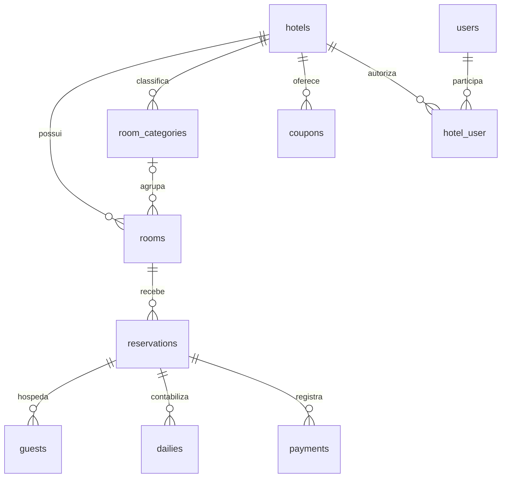

# Modelagem do banco de dados

Modelo físico MySQL conferido em 05/10/2026: **19 tabelas, 120 colunas e 10 chaves estrangeiras**. A comparação do arquivo Workbench com o schema `foco` confirmou os nomes dos campos, tipos equivalentes, nulabilidade e relações com suas regras de exclusão. O enunciado original está em `Desafio.md`; as migrations em `app/database/migrations` são a fonte executável da estrutura.

## Arquivos da modelagem

- [DER FOCO.mwb](<app/DER FOCO.mwb>): modelo editável no MySQL Workbench, incluindo tabelas de negócio e tabelas auxiliares do Laravel.
- [DER FOCO.png](<app/DER FOCO.png>): imagem exportada do modelo completo.
- Diagrama abaixo: visão resumida das relações de negócio para facilitar a leitura.

Abra o `.mwb` pelo menu **File → Open Model** no Workbench. O modelo é documentação da estrutura, não um backup dos registros. Para criar ou atualizar o banco da aplicação, execute as migrations conforme o README; não use sincronização automática do modelo como substituição às migrations.

## Relações principais

## Tabelas de negócio

| Tabela | Finalidade e regras principais |
|---|---|
| hotels | Hotéis; external_id único e opcional identifica a origem XML. |
| room_categories | Categorias por hotel; nome único dentro do hotel. |
| rooms | Unidades físicas do hotel; categoria opcional; external_id único. |
| reservations | Estadia em um quarto, com subtotal, desconto, taxa e total. Índice por quarto e datas; external_id único e opcional. |
| guests | Hóspedes de cada reserva, preservando nome e telefone daquela estadia. |
| dailies | Uma diária por noite; combinação reserva/data é única. |
| payments | Recebimentos da reserva; chave de idempotência única por reserva, quando informada. |
| coupons | Código único por hotel; valor fixo ou percentual, validade, mínimo e ativação. |
| users | Usuários autenticados; email único e senha armazenada com hash. |
| hotel_user | Vínculo usuário/hotel com perfil viewer ou manager; chave primária composta. |

## Tabelas auxiliares

| Tabela | Finalidade |
|---|---|
| personal_access_tokens | Tokens Sanctum armazenados como hash, com validade e relação polimórfica. |
| sessions | Sessões do Laravel. |
| password_reset_tokens | Estrutura Laravel para tokens de recuperação; não implica existência de fluxo público de recuperação na API. |
| cache e cache_locks | Cache e controle de bloqueios do scheduler. |
| jobs, job_batches e failed_jobs | Estruturas Laravel de filas e falhas. |
| migrations | Histórico das migrations aplicadas. |

## Integridade e limites

- FKs para hotel, quarto e categoria impedem exclusões que deixem registros dependentes. Hóspedes, diárias e pagamentos são excluídos em cascata caso uma reserva seja removida diretamente; a API não oferece exclusão de reserva.
- As FKs de `hotel_user` usam exclusão em cascata para remover vínculos quando o usuário ou hotel é excluído.
- `rooms.room_category_id` aceita null. A regra de categoria e quarto pertencerem ao mesmo hotel é validada pela aplicação; não existe FK composta para essa regra.
- Disponibilidade depende dos períodos das reservas, não de uma coluna de estoque. Sobreposição é impedida pela aplicação em transação com bloqueios no MySQL.
- `reservations.coupon_code` e `discount` preservam o desconto aplicado. coupon_code não é uma FK; mudanças posteriores no cupom não recalculam a reserva.
- Classificação de quartos representa a categoria atual, sem histórico de alterações da categoria por reserva.
- `personal_access_tokens` usa relação polimórfica e `sessions.user_id` não tem FK física; essas associações não fazem parte das dez chaves estrangeiras.
- Dados financeiros são DECIMAL(12,2), calculados em centavos inteiros pela aplicação.

## Atualizar o modelo

Após novas migrations, compare ou gere um novo modelo pelo **Database → Reverse Engineer**, selecionando a conexão local e o schema `foco`. Atualize o arquivo `.mwb` e sua exportação `.png`, revise o diff das migrations e versione os artefatos juntos. O diagrama completo contém tabelas auxiliares; para apresentação do domínio, use a visão resumida acima.
