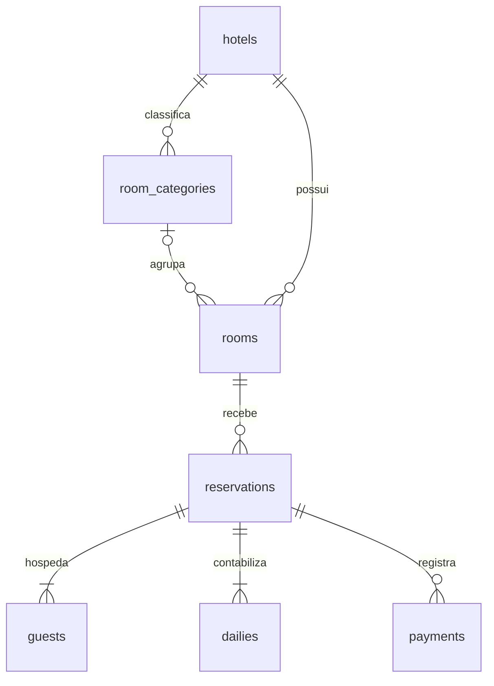

# Desafio Foco — Laravel

API REST em Laravel 12 e PHP 8.2+. Aplicação Laravel na raiz do repositório. A pasta `app/` contém as classes da aplicação. Os XMLs originais permanecem na raiz. Validação funcional por testes manuais e suíte automatizada PHPUnit.

Este README apresenta a aplicação, sua instalação e os principais recursos.

## Estrutura do projeto

O Laravel está diretamente na raiz: `artisan`, `composer.json`, `bootstrap/`, `config/`, `database/`, `public/`, `routes/`, `storage/` e `tests/` ficam ao lado deste README. A pasta `app/` contém somente o código PHP da aplicação (Controllers, Requests, Models, Services, Repositories e Interfaces). Os comandos locais são executados em `C:\PHP\Teste_Foco`, sem entrar em outra pasta `app`. Docker e documentos de modelagem também ficam na raiz.

## Documentação

O repositório publica o README, o guia Docker, a apresentação original do Laravel e a modelagem do banco. Os documentos pessoais de acompanhamento permanecem apenas na pasta local.

| Arquivo | Conteúdo |
|---|---|
| [GUIA_DOCKER.md](GUIA_DOCKER.md) | Configuração e execução do ambiente Docker. |
| [MODELAGEM_BANCO.md](MODELAGEM_BANCO.md) | Modelo Workbench, diagrama e regras do banco. |
| [README_LARAVEL.md](README_LARAVEL.md) | Apresentação original do framework Laravel. |

## Executar no Linux

### Com Docker (Laravel, MySQL e scheduler)

Tenha Git, Docker Engine em execução, Docker Compose com suporte aos perfis deste projeto e OpenSSL disponíveis. Não precisa instalar PHP, Composer ou MySQL no host. Na primeira instalação:

```bash
git clone https://github.com/iuri-bsilva/api-hoteleira-laravel.git
cd api-hoteleira-laravel
sh docker/init.sh
docker compose --env-file .env.docker config --quiet
docker compose --env-file .env.docker up -d --build
docker compose --env-file .env.docker ps -a
docker compose --env-file .env.docker logs setup
docker compose --env-file .env.docker exec --user www-data app php artisan users:create
docker compose --env-file .env.docker exec --user www-data app php artisan users:hotel SEU_EMAIL 1 manager
```

Substitua `SEU_EMAIL` pelo email cadastrado. Abra `http://127.0.0.1:8080/docs` e faça login. Enquanto o repositório estiver privado, o clone exige uma conta com acesso. O script preserva `.env.docker` se já existir; em uma instalação nova, gera credenciais aleatórias com permissão de leitura/escrita apenas para seu usuário. O container setup prepara o banco e o scheduler executa a importação horária. Não execute `php artisan serve` nem configure CRON adicional neste ambiente. Veja os comandos de testes, operação e persistência em [GUIA_DOCKER.md](GUIA_DOCKER.md).

### Sem Docker (desenvolvimento com SQLite)

Tenha Git, PHP 8.2+ e Composer 2, com as extensões exigidas pelo Composer e pela aplicação, incluindo PDO SQLite, DOM/XML e mbstring. Após clonar o projeto, execute em um checkout novo:

```bash
cd api-hoteleira-laravel
cp .env.example .env
composer install
php artisan key:generate
touch database/database.sqlite
php artisan migrate
php artisan hotels:import
php artisan db:seed --class=RoomCategorySeeder
php artisan users:create
php artisan users:hotel SEU_EMAIL 1 manager
php artisan serve --host=127.0.0.1 --port=8000
```

O `.env.example` utiliza SQLite; sem `DB_DATABASE` definido, o Laravel usa `database/database.sqlite`. Abra `http://127.0.0.1:8000/docs`. Mantenha o terminal do servidor aberto e, em outro terminal na raiz do projeto, execute `php artisan schedule:work` para o agendamento durante o desenvolvimento, ou configure o CRON descrito na seção de importação. Para testar, execute `php artisan test`. Não precisa de Node/npm para esta API. Para validar bloqueios concorrentes no MySQL, utilize o ambiente Docker.

## Testes automatizados PHPUnit

### Concorrência real no MySQL

Na raiz, execute `docker compose --env-file .env.docker --profile integration run --build --rm integration-tests`. A suíte separada `phpunit.mysql.xml` executa diretamente o PHPUnit e usa MySQL 8.4 em `mysql-concurrency`, banco `foco_concurrency`, sem porta publicada ou volume persistente (dados em tmpfs). Não utiliza o banco `foco` da aplicação. Uma verificação de host/banco/ambiente ocorre antes das migrations; os testes usam migrations completas por caso e revertem ao terminar. Não execute essa configuração contra um banco de uso real.

Cinco testes, com 34 verificações, passaram em 05/10/2026: reserva direta concorrente, categoria competindo com reserva direta pela última unidade, duas reservas da mesma categoria em unidades distintas, pagamentos concorrentes acima do saldo e reenvio concorrente da mesma chave. Dois processos PHP independentes usam barreira de início e mantêm brevemente o primeiro bloqueio real da aplicação para exercitar a sobreposição. Cada processo percorre o kernel HTTP com token de teste. O roteiro manual permanece disponível para repetir cenários com Insomnia/Swagger.

Depois dos testes, remova apenas o serviço temporário: `docker compose --env-file .env.docker --profile integration rm --stop --force mysql-concurrency`. Não use `down -v`, pois ele poderia remover os volumes da aplicação. A suíte normal tem 85 testes e 543 verificações em SQLite em memória, sem executar estes cinco casos automaticamente.

Na raiz do projeto, após `composer install`, execute `php artisan test`. Os testes de exemplo foram substituídos por casos de autenticação, permissões por hotel, CRUD, reservas/valores/limites de disponibilidade e importação XML com rollback e idempotência. `phpunit.xml` força SQLite `:memory:` e a classe base rejeita outra configuração antes de executar migrations. Não utiliza o banco SQLite local nem o MySQL dos containers. O canal audit é desabilitado na suíte para não misturar seus registros manuais.

Pelo Docker, na raiz: `docker compose --env-file .env.docker --profile test run --build --rm tests`. O serviço de testes usa uma imagem própria com dependências de desenvolvimento, sem volumes do projeto e sem depender do MySQL. A aplicação normal continua instalada com `--no-dev`. A suíte normal verifica regras funcionais em SQLite; a configuração separada acima valida concorrência com bloqueio de linha no MySQL.

## Executar a aplicação no Windows

Alternativa com Laravel, MySQL e scheduler em containers: veja [GUIA_DOCKER.md](GUIA_DOCKER.md). Esse ambiente usa a porta 8080 e banco independente do SQLite.

```powershell
cd C:\PHP\Teste_Foco
composer install
# Em outro checkout: Copy-Item .env.example .env
# Em outro checkout: php artisan key:generate
# Em outro checkout: New-Item database/database.sqlite -ItemType File
php artisan migrate
php artisan hotels:import
php artisan serve --host=127.0.0.1 --port=8000
```

A instalação local já tem chave, banco SQLite e os dados importados. Não precisa de Node/npm para a API. Em um novo checkout, crie o arquivo SQLite antes de migrar. Nunca versione `.env`, `vendor` ou o banco local. As migrations e `composer.lock` permitem reproduzir a estrutura e as dependências.

SQLite permite começar sem configurar servidor. Para MySQL, crie um banco `foco` e configure o `.env`:

```dotenv
DB_CONNECTION=mysql
DB_HOST=127.0.0.1
DB_PORT=3306
DB_DATABASE=foco
DB_USERNAME=root
DB_PASSWORD=
```

Depois rode `php artisan config:clear`, `php artisan migrate` e `php artisan hotels:import`. MySQL ainda precisa ser validado manualmente nesse ambiente. Para uso com requisições concorrentes, utilize MySQL: as operações de reserva e alteração de quarto bloqueiam a linha do quarto durante a transação. SQLite não oferece bloqueio de linha.

## Autenticação por token

### Permissões por hotel

Cada usuário inicia sem acesso a hotéis; a migração não concede vínculos aos usuários existentes. Na raiz do projeto, conceda acesso com `php artisan users:hotel SEU_EMAIL 1 manager`. Use o ID interno do hotel. `viewer` permite consultar hotéis, quartos e reservas; `manager` permite também cadastrar/alterar/excluir quartos e criar reservas. Para alterar perfil: `php artisan users:hotel SEU_EMAIL 1 viewer`. Para revogar: `php artisan users:hotel SEU_EMAIL 1 revoke`. As alterações valem nas próximas requisições, sem precisar emitir novo token. Repita o comando para outros hotéis se necessário.

As listagens são filtradas pelos hotéis vinculados. Sem vínculos, retornam 200 com data vazio. Acesso direto a um registro existente de hotel sem vínculo retorna 403 JSON. Operações de escrita exigem manager; mudança de hotel de quarto exige manager tanto na origem quanto no destino, além da regra que impede transferir quarto reservado. `GET /api/auth/me` retorna hotéis vinculados e perfil em `pivot.role`. A gestão dos vínculos ocorre exclusivamente pelo terminal administrativo; não há rota pública para conceder privilégios. A importação XML continua administrativa e não é limitada pelos vínculos de usuário.

Crie seu usuário no terminal, na raiz do projeto, com `php artisan users:create`. Informe nome, email e uma senha própria com pelo menos 12 caracteres, letras e números; a senha é solicitada de forma oculta e precisa ser confirmada. Não há cadastro público nem senha padrão. Faça login com `POST /api/auth/login` e JSON `{"email":"seu-email@exemplo.com","password":"SUA_SENHA","device_name":"Insomnia"}`. O retorno contém `access_token` e `expires_at`; o token expira após oito horas e é armazenado como hash no banco.

Todas as rotas de hotéis, quartos e reservas agora exigem `Authorization: Bearer SEU_TOKEN`. No Insomnia, escolha Auth → Bearer Token e cole o token. No Swagger, clique **Authorize** e cole somente o valor de `access_token`, sem escrever Bearer. `/docs`, `/openapi.json` e o login continuam públicos. `GET /api/auth/me` consulta o usuário; `POST /api/auth/logout` revoga apenas o token usado na requisição. Após logout, faça novo login para continuar os testes.

Sem token válido, a resposta é 401 JSON. Credenciais incorretas retornam 401 com mensagem genérica. Login aceita até cinco tentativas por combinação email/IP e dez por IP por minuto; rotas autenticadas aceitam 60 requisições por minuto. Excesso retorna 429, com tempo de espera em Retry-After. Usuários autenticados acessam somente os hotéis vinculados, conforme seu perfil. Para limpar registros expirados, execute `php artisan sanctum:prune-expired --hours=24`; a validade é verificada mesmo antes da limpeza.

Em um novo checkout, rode `composer install` e `php artisan migrate`. Em produção, use HTTPS e `APP_DEBUG=false`. Não compartilhe tokens nem os inclua em commits.

## Swagger / OpenAPI 3.0

Com o servidor Laravel em execução, abra `http://127.0.0.1:8000/docs`. A página Swagger UI documenta as vinte e duas operações existentes, schemas, exemplos e respostas. Expanda uma operação, clique em **Try it out**, preencha os campos e clique em **Execute**. As requisições alteram o mesmo banco usado pelo Insomnia; escolha períodos livres para reservas.

Contrato versionado: `public/openapi.json`, disponível em `http://127.0.0.1:8000/openapi.json`. Também pode ser importado no Insomnia. Ao mudar a API, atualize esse contrato. Os assets do Swagger UI 5.32.0 são carregados de um CDN e exigem internet para abrir a interface; o contrato JSON é servido localmente. A interface não envia o contrato para o validador externo do Swagger.

## Rotas

### Categorias e disponibilidade agrupada

No Docker, a preparação cria automaticamente Standard, Luxo e Suíte para cada hotel existente, sem duplicar nomes ou alterar vínculos. Para executar localmente ou após adicionar hotéis, use `php artisan db:seed --class=RoomCategorySeeder` após a importação. O seeder apenas cria categorias; vincule os quartos para formar o estoque.

GET/POST `/api/hotels/{hotel}/categories` lista e cadastra categorias por hotel. Nome é único no hotel, até 100 caracteres. Viewer consulta, manager cadastra. Exemplo: `{"name":"Standard"}`. Categoria inicia com estoque zero; cada unidade é um quarto físico vinculado por `room_category_id` no POST/PATCH de quartos. Categoria deve pertencer ao mesmo hotel do quarto; pode ser null para remover vínculo. Ao transferir um quarto sem reservas de hotel, remova a categoria ou informe uma do destino. Nesta etapa não há alteração/exclusão de categorias. Vínculos representam a classificação atual dos quartos, sem histórico de classificação.

GET `/api/hotels/1/categories/availability?check_in=2028-05-10&check_out=2028-05-11` retorna categorias paginadas com `rooms_count` (total vinculado) e `available_count` (livres durante todo o período). Dez quartos físicos Standard significam estoque de dez unidades. Datas obrigatórias, check-out exclusivo, até 366 noites. Categorias vazias/esgotadas retornam zero. Não conta quartos sem categoria, nem soma vagas de quartos diferentes que estejam livres apenas em partes da estadia.

POST `/api/reservations` aceita **somente um** de `room_id` ou `room_category_id`. Com categoria, escolhe o quarto livre com menor ID e retorna `room_id` alocado. Demais campos e regras de desconto, cupons, taxas e pagamentos permanecem iguais. Sem unidade livre retorna 409, sem reserva parcial. No MySQL, seleção bloqueia a categoria e seus quartos na transação; consulta de estoque é informativa e não garante reserva futura. XML continua identificando quartos físicos: quartos antigos começam sem categoria e reimportar no mesmo hotel preserva vínculos. Importação que tente mudar de hotel um quarto categorizado falha e reverte o lote; remova o vínculo antes de reconciliar a origem.

### Gestão de pagamentos

GET `/api/reservations/{reservation}/payments` retorna `reservation_id`, `total`, `paid`, `balance`, `status` (`unpaid`, `partial` ou `paid`) e `payments`. Viewer e manager do hotel podem consultar. Reserva com total zero é considerada quitada. Os cálculos usam centavos inteiros.

Manager registra recebimentos após a criação da reserva por POST na mesma rota: `{"method":1,"value":"30.00","idempotency_key":"123e4567-e89b-42d3-a456-426614174000"}`. Valor deve ser positivo, ter no máximo duas casas decimais e não superar o saldo, considerando todos os pagamentos existentes. Retorna 201 com `payment` e `summary`. Gere uma UUID nova para cada operação; em uma repetição da mesma operação, mantenha a chave. Mesma chave na mesma reserva e mesmos método/valor retornam 200 e o pagamento anterior, sem duplicar; outra combinação retorna 409. Saldo insuficiente ou campos inválidos retornam 422. Não há alteração, exclusão, estorno nem integração com gateway: a API registra recebimentos administrativos. Método mantém o código numérico do XML sem atribuir significado comercial.

No MySQL, registro bloqueia quarto e reserva na transação para impedir pagamentos concorrentes acima do total. SQLite dos testes verifica regras e idempotência, sem reproduzir bloqueio de linha. `recorded_at` e `idempotency_key` ficam nulos para registros antigos, XML e pagamentos enviados na criação da reserva. Pagamentos da nova rota mantêm ID/chave durante reimportações: a origem XML só substitui pagamentos sem chave. Se a soma dos pagamentos XML e dos registros da nova rota superar o total importado, o lote inteiro é revertido. A origem deve evitar informar novamente no XML um recebimento já registrado pela API; não há conciliação automática entre fontes.

### Consulta de disponibilidade

GET `/api/rooms/availability?check_in=2027-10-10&check_out=2027-10-12&hotel_id=1` consulta unidades físicas livres durante todo o período. Datas obrigatórias, saída posterior à entrada e limite de 366 noites. `hotel_id` é opcional; sem filtro, retorna quartos de todos os hotéis vinculados. Viewer e manager podem consultar. Hotel sem acesso retorna 403; dados inválidos, 422. Resposta paginada com 20 quartos, `data` e `total` de unidades livres, preservando filtros nos links. Reservas que terminam na entrada ou começam na saída não geram conflito. Cada quarto é uma unidade física; o estoque agrupado também pode ser consultado nas rotas de categorias. A consulta não garante disponibilidade futura: a criação da reserva revalida o período dentro da transação e pode retornar 409.

### Cupons por hotel

Cupons aceitam `type`: `fixed` (padrão, valor em reais) ou `percentage` (percentual em `amount`, de 0.01 a 100.00, até duas casas). Exemplo: `{"code":"FOCO10P","type":"percentage","amount":"10.00"}`. O percentual aplica-se ao subtotal das diárias, antes da taxa. Cálculo usa inteiros, arredondando ao centavo mais próximo com empate para cima. Diárias 250.00, cupom 10% e taxa 10.00 resultam em desconto 25.00 e total 235.00. Cupons existentes recebem type fixed na migração.

Manager do hotel pode listar/criar cupons por GET/POST `/hotels/{hotel}/coupons` e ativar/desativar por PATCH `/hotels/{hotel}/coupons/{coupon}` com `{"active":false}`. Código é único por hotel e normalizado para maiúsculas. Exemplo de cadastro: `{"code":"FOCO30","amount":"30.00","minimum_subtotal":"200.00","active":true}`. `valid_from` e `valid_until` são datas opcionais e inclusivas, avaliadas na data da criação da reserva, no fuso da aplicação (UTC por padrão). A validade não é avaliada pelo check-in. Valor deve ser positivo, com até duas casas decimais.

Na reserva, envie `"coupon_code":"FOCO30"` e omita `discount`. Cupom deve pertencer ao hotel do quarto, estar ativo/dentro da validade e satisfazer subtotal mínimo; caso contrário, 422. Desconto do cupom é limitado ao subtotal e pode zerar o valor das diárias. Taxa continua sendo somada e pagamentos são validados pelo total final. Código e desconto ficam salvos na reserva; desativar o cupom não altera reservas antigas. Cupons são reutilizáveis, sem limite de usos; limites de utilização ainda não implementados. Não há exclusão nem alteração de código/valores: desative e crie outro código se necessário. XMLs continuam sem cupom.

### Desconto e taxa de serviço

POST `/reservations` aceita `discount` e `service_fee`, valores opcionais em reais com até duas casas decimais, por exemplo `"discount":"30.00","service_fee":"10.00"`. O subtotal é a soma das diárias e o total final é `subtotal - discount + service_fee`. Com diárias de 250.00, o exemplo resulta em 230.00. O servidor retorna e persiste os quatro valores separadamente. O subtotal/total enviados pelo cliente são ignorados. Ausência de desconto/taxa equivale a zero; reservas anteriores são migradas com subtotal igual ao total antigo e ajustes zero.

Desconto não pode ser negativo nem superar o subtotal, mesmo se houver taxa. Desconto integral é permitido e pode resultar em total zero. Pagamentos não podem superar o total final. Subtotal, ajustes e total têm limite de 9999999999.99. Apenas manager pode criar essas reservas. Ajustes são valores fixos informados pelo gestor; cupons fixos e percentuais por hotel estão disponíveis; promoções automáticas ainda não foram implementadas. Importações XML continuam com desconto/taxa zero, preservando o formato de origem.

Base: `http://127.0.0.1:8000/api`. Envie `Accept: application/json` e, nos corpos JSON, `Content-Type: application/json`.

| Método | Rota | Operação |
|---|---|---|
| GET | /hotels | Listar hotéis importados |
| GET | /rooms | Listar quartos, 20 por página |
| GET | /rooms/{id} | Consultar quarto |
| POST | /rooms | Cadastrar quarto |
| PUT/PATCH | /rooms/{id} | Alterar quarto |
| DELETE | /rooms/{id} | Excluir quarto sem reservas |
| GET | /reservations | Listar reservas |
| GET | /reservations/{id} | Consultar reserva e detalhes |
| POST | /reservations | Criar reserva |

Quarto: `{"hotel_id":1,"name":"Suíte teste"}`. Os IDs da API são IDs internos; `external_id` representa o código de origem XML e não pode ser definido pelo cliente.

Reserva:

```json
{
  "room_id": 1,
  "check_in": "2027-01-10",
  "check_out": "2027-01-12",
  "guests": [{"name":"Ana","last_name":"Silva","phone":"5571999999999"}],
  "dailies": [{"date":"2027-01-10","value":"100.00"},{"date":"2027-01-11","value":"150.00"}],
  "payments": [{"method":1,"value":"100.00"}]
}
```

O total retornado será `250.00`, calculado no servidor. Informe uma diária por noite, sem incluir a data de saída. Limite de 366 noites. Valores monetários têm no máximo duas casas decimais; cálculos usam centavos inteiros. Pagamentos são opcionais e podem ser parciais, mas não podem superar o total final após os ajustes. `method` preserva o código numérico do XML, que não define uma tabela de significados. Uma reserva que termina no dia de entrada de outra não gera conflito. Datas históricas são aceitas para importar os exemplos. Cada quarto representa uma unidade física, com uma reserva por período.

Erros: 422 para validação, 404 para registro inexistente e 409 para conflito de disponibilidade ou exclusão/transferência de quarto reservado. Respostas das rotas `/api/*`, inclusive erros, são JSON.

## Importação e agendamento

```powershell
php artisan hotels:import
php artisan hotels:import --path="C:\PHP\Teste_Foco"
```

A primeira opção lê `database/xml`; a segunda lê os arquivos originais e deve falhar na reserva 6. O original informa `2022-12-03` em uma reserva de `2022-10-01` a `2022-10-04`. Na cópia local, corrigimos apenas essa diária para `2022-10-03`, inferindo a terceira noite do período. Essa decisão deve ser confirmada com a origem dos dados em uma integração real.

O lote inteiro é transacional: qualquer erro reverte todas as alterações desse lote. Reexecuções atualizam pelos IDs externos e substituem hóspedes, diárias e pagamentos de origem sem duplicá-los, preservando pagamentos da nova rota. Registros ausentes nos XMLs não são excluídos. Reservas criadas pela API possuem código externo nulo e não são sobrescritas pelos XMLs. XML inválido, DTD e entidades são rejeitados; limite de 10 MB por arquivo. Não permita que fontes externas não confiáveis escolham o caminho de importação.

O comando foi registrado para execução de hora em hora com proteção contra sobreposição pelo scheduler. Em Linux, adicione ao CRON (substitua o caminho):

```cron
* * * * * cd /caminho/projeto && php artisan schedule:run >> storage/logs/scheduler.log 2>&1
```

No Windows, configure o Agendador de Tarefas para executar a cada minuto: programa `C:\xampp\php\php.exe`, argumentos `artisan schedule:run`, iniciar em `C:\PHP\Teste_Foco`. Alternativa durante desenvolvimento: `php artisan schedule:work`. O agendamento do sistema operacional não foi criado automaticamente.

Logs: `storage/logs/laravel.log` e, nas execuções agendadas, `storage/logs/import.log`.

## Modelagem

Arquivo editável do Workbench: [DER FOCO.mwb](<DER FOCO.mwb>); exportação visual: [DER FOCO.png](<DER FOCO.png>). As migrations continuam sendo a fonte executável do schema.

## Logs da API

Requisições `/api/*` recebem o header `X-Request-ID` gerado pelo servidor. O registro `api.request` contém esse identificador, ID do usuário autenticado (ou null), método HTTP, template da rota, status e duração em milissegundos. Sucessos têm nível info, respostas 4xx warning e 5xx error. Login/logout, validações, acessos negados e operações em quartos/reservas passam pelo mesmo registro. Não são gravados corpo, query string, headers, senha, token, email, IP ou dados de hóspedes nesse canal.

Arquivos `storage/logs/audit-AAAA-MM-DD.log`, com retenção configurada de 14 dias. A limpeza dos arquivos antigos ocorre durante novas gravações. Datas seguem o fuso configurado na aplicação (UTC por padrão). No Docker, os logs ficam no volume persistente; consulte com `docker compose --env-file .env.docker exec app sh -c 'tail -n 20 storage/logs/audit-*.log'`. Logs técnicos Laravel e logs de importação continuam separados. O canal audit é um registro de acesso/operação, não um histórico dos valores alterados nem uma trilha inviolável. Falhas de escrita são sinalizadas no log do servidor sem mudar a resposta da API.

## Estrutura do banco



Migrations: `database/migrations/2026_10_03_000001_create_hotel_tables.php`. O hotel da reserva é derivado do quarto, evitando redundância. Hóspedes são registros de cada reserva, preservando o nome/telefone daquele momento. Exclusão de quarto reservado é bloqueada; filhos de reserva têm exclusão em cascata. O importador valida também a correspondência entre os códigos de hotel e quarto e o total informado no XML.

## Desenvolvimento e escopo

### Separação de responsabilidades em pagamentos

O módulo de pagamentos adota o fluxo `StorePaymentRequest → PaymentController → PaymentServiceInterface → PaymentService → PaymentRepositoryInterface → PaymentRepository`. O Request valida e normaliza a entrada e verifica o acesso antes da validação. O controller monta a resposta JSON e escolhe 201 (novo recebimento) ou 200 (reenvio). O serviço coordena permissões, saldo, idempotência e a transação inteira; o repository concentra as consultas Eloquent e a gravação. Os contratos ficam em `app/Interfaces`, as implementações em `app/Services` e `app/Repositories`, com bindings em `AppServiceProvider`.

`PaymentResult` transporta pagamento, resumo e indicação de criação, sem construir uma resposta HTTP. Os bloqueios continuam na ordem quarto → reserva, dentro da mesma transação, e a permissão é conferida novamente após bloquear o quarto. Os cálculos em centavos ainda reutilizam os métodos existentes de `ReservationService`. Rotas, JSONs, códigos HTTP e estrutura do banco foram preservados.

### Separação de responsabilidades em quartos

`StoreRoomRequest`, `UpdateRoomRequest` e `RoomAvailabilityRequest` validam os campos de cadastro, alteração e consulta. A comparação entre datas só ocorre após validar seus tipos e formatos, incluindo o limite de 366 noites. `RoomController` delega ao contrato `RoomServiceInterface` e mantém a resposta HTTP e os links de paginação. `RoomService` verifica permissões e regras de transferência/exclusão e compatibilidade entre categoria e hotel. `RoomRepository` implementa as consultas, relacionamentos, persistência e bloqueio do quarto. Ambos os contratos estão registrados em `AppServiceProvider`.

Atualização e exclusão preservam a transação e o bloqueio de linha, com nova verificação de permissão após o bloqueio. Transferência exige manager nos dois hotéis e ausência de reservas; categoria omitida mantém o vínculo, enquanto `null` o remove. A consulta de disponibilidade continua filtrada pelos hotéis acessíveis, com saída exclusiva e 20 registros por página.

### Separação de responsabilidades em cupons

`StoreCouponRequest` normaliza o código, valida os campos e sua unicidade por hotel; `UpdateCouponRequest` aceita somente `active` e confere o vínculo hotel/cupom antes da permissão. `CouponController` delega a `CouponServiceInterface`. O serviço verifica acesso manager, limite percentual e ordem das datas de validade, trata duplicidade e coordena a transação de ativação/desativação. `CouponRepository` concentra as consultas Eloquent, a gravação e o bloqueio de linha. Os contratos estão registrados em `AppServiceProvider`.

As rotas, respostas e regras foram preservadas: listagem também exige manager, cupom de outro hotel na rota retorna 404, cadastro retorna 201 e PATCH altera apenas a ativação. A aplicação do desconto na reserva continua em `ReservationService`; esta etapa separa a gestão dos cupons.

### Separação de responsabilidades em categorias

`StoreRoomCategoryRequest` valida nome único no hotel e exige manager. `CategoryAvailabilityRequest` verifica acesso ao hotel e reutiliza `StayPeriodRequest`, também usado na disponibilidade de quartos, para validar datas e limite de 366 noites. `RoomCategoryController` delega ao contrato `RoomCategoryServiceInterface` e monta respostas e links de paginação. O serviço verifica permissões e trata nomes duplicados; `RoomCategoryRepository` concentra cadastro e consultas com `rooms_count` e `available_count`.

Viewer pode consultar, manager pode cadastrar. Categorias vazias permanecem na resposta com contagem zero; a disponibilidade exige que cada quarto esteja livre durante toda a estadia, sem somar noites livres de unidades diferentes. Consultas continuam informativas: a alocação e os bloqueios da criação da reserva permanecem em `ReservationService`. Não foram adicionadas rotas de alteração/exclusão de categorias.

### Separação de responsabilidades em reservas

`StoreReservationRequest` valida a entrada HTTP usando as regras de `ReservationDataValidator`. O serviço também utiliza esse validador, pois XML e chamadas internas não passam pelo Form Request; as regras de campos ficam em um único lugar. O controller recebe `ReservationServiceInterface` e coordena cadastro, listagem e consulta, sem queries. `ReservationService` mantém as regras de noites, valores, cupons, permissões, alocação e a transação completa. `ReservationRepository` concentra consultas e persistência da reserva e de seus filhos.

Os bloqueios permanecem dentro da transação: categoria, quartos ordenados, cupom e consultas de sobreposição usam as mesmas leituras com bloqueio. A consulta de conflito usa `lockForUpdate()->first()`, preservando a leitura atual no MySQL. O repository recebe valores calculados pelo serviço; subtotal e total informados pelo cliente não são persistidos. Reimportações localizam a reserva pelo ID externo, substituem hóspedes/diárias/pagamentos de origem e preservam pagamentos com chave de idempotência. `ImportHotelXml` recebe a interface do serviço e continua envolvendo todo o lote em uma transação, com rollback integral em caso de erro.

Datas devem ser strings válidas antes da comparação, tanto pela API quanto pelo serviço compartilhado. A suíte inclui entradas com datas em arrays e confirma 422 sem gravação parcial. Não houve alteração de migrations, rotas ou JSONs.

### Separação de responsabilidades em autenticação

`LoginRequest` valida email, senha e nome opcional do dispositivo. `AuthController` chama `AuthServiceInterface` e monta as respostas HTTP, incluindo 401 genérico para credenciais inválidas. `AuthService` verifica o hash da senha e define a validade de oito horas. `AuthRepository` consulta o usuário, cria o token Sanctum, carrega seus hotéis e revoga apenas o token corrente. Os contratos são registrados em `AppServiceProvider`.

As rotas e os limites de requisições permanecem iguais. O email é buscado em minúsculas, sem alterar a senha. O token em texto aparece apenas no retorno do login; Sanctum armazena seu hash e o model oculta a senha do usuário no JSON. `/auth/me` preserva os hotéis e perfis; logout mantém os tokens de outros dispositivos. A suíte verifica credenciais incorretas, validade, revogação, isolamento entre dispositivos e limite de tentativas.

### Separação de responsabilidades em hotéis e revisão final

`GET /api/hotels` utiliza `HotelController → HotelServiceInterface → HotelService → HotelRepositoryInterface → HotelRepository`. A consulta preserva os hotéis vinculados ao usuário, os dados do pivot e a paginação de 20. Usuário sem vínculos recebe 200 com lista vazia. A rota continua protegida por Sanctum e limite de requisições. Como não há corpo de entrada nem novos filtros nessa operação, não foi criado um Form Request adicional.

Os sete controllers da API utilizam services por interface; `routes/api.php` apenas declara rotas e middleware. A revisão confirmou ausência de consultas Eloquent, validações inline, cálculos financeiros e transações nos controllers. Requests validam entrada, services coordenam regras e transações, repositories consultam/persistem, e `AppServiceProvider` registra os contratos. Permissões por hotel continuam centralizadas em métodos do usuário chamados pelos services/Requests. Comandos administrativos, models e seeders mantêm sua organização específica; a refatoração não criou uma abstração para cada tabela.

Separação: controllers recebem HTTP, services coordenam regras e transações, repositories consultam e persistem, models representam relações, migrations versionam o banco e `ImportHotelXml` executa a integração. Dados aceitos são validados e limitados por campos preenchíveis. A API usa autenticação Sanctum por token. Descontos e taxas fixas, Docker, autenticação e permissões foram implementados. Promoções automáticas e interface administrativa ainda não foram implementadas.

Para publicar, revise os vínculos e perfis dos usuários e `APP_DEBUG=false`. Use o diretório `public` como raiz do servidor web. Os testes de exemplo foram substituídos pela suíte funcional do projeto.

## Versionamento

O repositório local está inicializado e conectado a `https://github.com/iuri-bsilva/api-hoteleira-laravel`. O histórico usa mensagens por escopo: `feat:` para funcionalidades, `build:` para infraestrutura, `test:` para testes, `docs:` para documentação e `fix:` para correções. Consulte `git log --oneline`. Confira `git status` e o diff antes de cada commit; `.env`, `.env.docker`, bancos locais, dependências e logs não devem ser versionados. Para novas branches, use `codex/nome-da-alteracao`.
## Juros por atraso

Ao criar uma reserva, envie opcionalmente `due_date` (data de vencimento) e `daily_interest_rate` (percentual diário, por exemplo `"1.00"` para 1% ao dia). Os dois campos devem ser informados juntos. Sem eles, não há juros. A taxa aceita valores de 0,01% a 100% com até duas casas decimais.

Consulte `GET /api/reservations/{id}/payments`: `total` mantém o preço original; `total_due` inclui os juros acumulados; `principal_balance`, `interest_total`, `interest_balance` e `balance` detalham a dívida. Os juros são simples, sobre o principal pendente, por dias de calendário no fuso da aplicação. Começam após o vencimento ou a criação, o que ocorrer por último. Não há multa nem juros sobre juros. Cada intervalo entre recebimentos é arredondado ao centavo, com empate para cima.

Recebimentos pagam primeiro juros vencidos e depois principal. A quitação encerra o acúmulo. Pagamentos iniciais e importados sem data de registro reduzem o principal desde a criação. O cálculo acontece na consulta ou recebimento, sem tarefa Cron adicional. A importação XML não configura juros; sua estrutura não contém esses campos.

Para gerar dados fictícios de demonstração, execute `php artisan db:seed --class=LateInterestExampleSeeder` ou, no Docker, `docker compose --env-file .env.docker exec --user www-data app php artisan db:seed --class=LateInterestExampleSeeder --force`. Este seeder é opcional e não faz parte da inicialização padrão. Ele cria quatro quartos `DEMO JUROS` no primeiro hotel existente, com reservas de R$ 100,00, taxa ilustrativa de 1% ao dia e histórico de cinco dias: sem pagamento, pagamento inicial, pagamento parcial após atraso e quitação com juros. Reexecutar preserva os exemplos existentes. Os juros dos exemplos não quitados continuam crescendo diariamente; consulte os valores atuais pela rota de pagamentos. O usuário autenticado precisa de acesso ao hotel dos exemplos.
