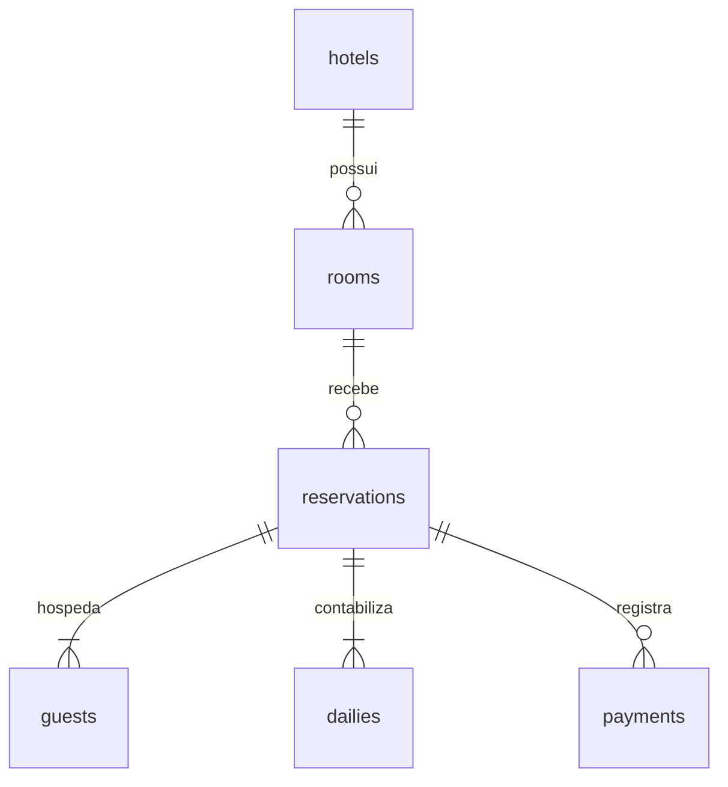

# Desafio Foco — Laravel

API REST em Laravel 12 e PHP 8.2+. Aplicação na pasta `app`. Os XMLs originais permanecem na raiz. Validação funcional por testes manuais; não foi criada uma suíte PHPUnit para o desafio.

## Executar no Windows

```powershell
cd C:\PHP\Teste_Foco\app
composer install
# Em outro checkout: Copy-Item .env.example .env
# Em outro checkout: php artisan key:generate
# Em outro checkout: New-Item database/database.sqlite -ItemType File
php artisan migrate
php artisan hotels:import
php artisan serve --host=127.0.0.1 --port=8000
```

A instalação local já tem chave, banco SQLite e os dados importados. Não precisa de Node/npm para a API. Em um novo checkout, crie o arquivo SQLite antes de migrar. Nunca versione `.env`, `vendor` ou o banco local. As migrations e `composer.lock` permitem reproduzir a estrutura e as dependências.

SQLite permite começar sem configurar servidor. Para MySQL, crie um banco `foco` e configure o `.env`:

```dotenv
DB_CONNECTION=mysql
DB_HOST=127.0.0.1
DB_PORT=3306
DB_DATABASE=foco
DB_USERNAME=root
DB_PASSWORD=
```

Depois rode `php artisan config:clear`, `php artisan migrate` e `php artisan hotels:import`. MySQL ainda precisa ser validado manualmente nesse ambiente. Para uso com requisições concorrentes, utilize MySQL: as operações de reserva e alteração de quarto bloqueiam a linha do quarto durante a transação. SQLite não oferece bloqueio de linha.

## Rotas

Base: `http://127.0.0.1:8000/api`. Envie `Accept: application/json` e, nos corpos JSON, `Content-Type: application/json`.

| Método | Rota | Operação |
|---|---|---|
| GET | /hotels | Listar hotéis importados |
| GET | /rooms | Listar quartos, 20 por página |
| GET | /rooms/{id} | Consultar quarto |
| POST | /rooms | Cadastrar quarto |
| PUT/PATCH | /rooms/{id} | Alterar quarto |
| DELETE | /rooms/{id} | Excluir quarto sem reservas |
| GET | /reservations | Listar reservas |
| GET | /reservations/{id} | Consultar reserva e detalhes |
| POST | /reservations | Criar reserva |

Quarto: `{"hotel_id":1,"name":"Suíte teste"}`. Os IDs da API são IDs internos; `external_id` representa o código de origem XML e não pode ser definido pelo cliente.

Reserva:

```json
{
  "room_id": 1,
  "check_in": "2027-01-10",
  "check_out": "2027-01-12",
  "guests": [{"name":"Ana","last_name":"Silva","phone":"5571999999999"}],
  "dailies": [{"date":"2027-01-10","value":"100.00"},{"date":"2027-01-11","value":"150.00"}],
  "payments": [{"method":1,"value":"100.00"}]
}
```

O total retornado será `250.00`, calculado no servidor. Informe uma diária por noite, sem incluir a data de saída. Limite de 366 noites. Valores monetários têm no máximo duas casas decimais; cálculos usam centavos inteiros. Pagamentos são opcionais e podem ser parciais, mas não podem superar o total. `method` preserva o código numérico do XML, que não define uma tabela de significados. Uma reserva que termina no dia de entrada de outra não gera conflito. Datas históricas são aceitas para importar os exemplos. Cada quarto representa uma unidade física, com uma reserva por período.

Erros: 422 para validação, 404 para registro inexistente e 409 para conflito de disponibilidade ou exclusão/transferência de quarto reservado. Respostas das rotas `/api/*`, inclusive erros, são JSON.

## Importação e agendamento

```powershell
php artisan hotels:import
php artisan hotels:import --path="C:\PHP\Teste_Foco"
```

A primeira opção lê `app/database/xml`; a segunda lê os arquivos originais e deve falhar na reserva 6. O original informa `2022-12-03` em uma reserva de `2022-10-01` a `2022-10-04`. Na cópia local, corrigimos apenas essa diária para `2022-10-03`, inferindo a terceira noite do período. Essa decisão deve ser confirmada com a origem dos dados em uma integração real.

O lote inteiro é transacional: qualquer erro reverte todas as alterações desse lote. Reexecuções atualizam pelos IDs externos e substituem hóspedes, diárias e pagamentos sem duplicá-los. Registros ausentes nos XMLs não são excluídos. Reservas criadas pela API possuem código externo nulo e não são sobrescritas pelos XMLs. XML inválido, DTD e entidades são rejeitados; limite de 10 MB por arquivo. Não permita que fontes externas não confiáveis escolham o caminho de importação.

O comando foi registrado para execução de hora em hora com proteção contra sobreposição pelo scheduler. Em Linux, adicione ao CRON (substitua o caminho):

```cron
* * * * * cd /caminho/projeto/app && php artisan schedule:run >> storage/logs/scheduler.log 2>&1
```

No Windows, configure o Agendador de Tarefas para executar a cada minuto: programa `C:\xampp\php\php.exe`, argumentos `artisan schedule:run`, iniciar em `C:\PHP\Teste_Foco\app`. Alternativa durante desenvolvimento: `php artisan schedule:work`. O agendamento do sistema operacional não foi criado automaticamente.

Logs: `app/storage/logs/laravel.log` e, nas execuções agendadas, `app/storage/logs/import.log`.

## Modelagem



Migrations: `app/database/migrations/2026_10_03_000001_create_hotel_tables.php`. O hotel da reserva é derivado do quarto, evitando redundância. Hóspedes são registros de cada reserva, preservando o nome/telefone daquele momento. Exclusão de quarto reservado é bloqueada; filhos de reserva têm exclusão em cascata. O importador valida também a correspondência entre os códigos de hotel e quarto e o total informado no XML.

## Desenvolvimento e escopo

Separação: controllers recebem HTTP, `ReservationService` centraliza regras usadas pela API e importação, models representam relações, migrations versionam o banco e `ImportHotelXml` executa a integração. Dados aceitos são validados e limitados por campos preenchíveis. A API atual é uma base local sem autenticação. Autenticação, permissões, descontos, taxas, interface administrativa, Docker e OpenAPI são diferenciais ainda não implementados.

Para publicar, configure autenticação/autorização e `APP_DEBUG=false`. Use o diretório `app/public` como raiz do servidor web. O roteiro de validação está em `TESTES_MANUAIS.md`. Os arquivos de testes que vieram no esqueleto Laravel não foram executados.

## Versionamento

Para iniciar o repositório local, execute na raiz `git init`, `git add .` e `git commit -m "feat: implementa API hoteleira e importação XML"`. Depois, crie commits pequenos por funcionalidade (`feat:`, `fix:`, `docs:`). Não há repositório remoto configurado.
